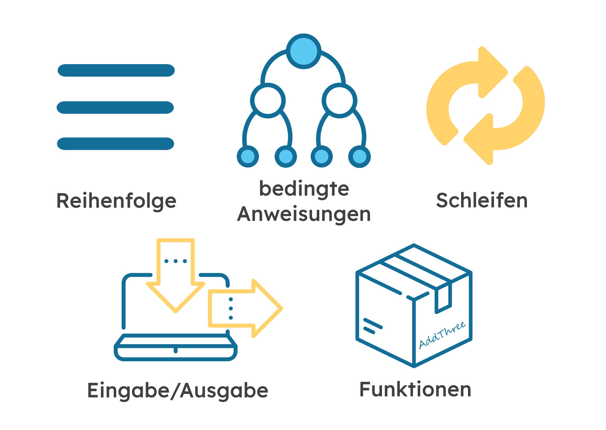

******************
Kontrollstrukturen
******************

Das erste Programm im Abschnitt *Erste Schritte* bestand aus aufeinanderfolgenden Anweisungen, 
die nacheinander ausgeführt wurden. In den meisten Fällen wirst du jedoch eine komplexere Struktur 
für deinen Code benötigen. Du wirst dabei kontrollieren wollen, welche Anweisungen ausgeführt werden 
oder wie oft sie ausgeführt werden. Dies ist der Zeitpunkt, an dem die in diesem Abschnitt vorgestellten 
Kontrollstrukturen - wie z.B. *Schleifen* oder *bedingte Anweisungen* - nützlich sind. 

Bedingte Anweisungen mit if
============================

Das erste Beispiel für einen Anwendungsfall von Kontrollstrukturen liegt dann vor, wenn du einen Teil deines 
Codes nur dann ausführen willst, **wenn** (``if``) eine bestimmte Bedingung erfüllt ist. 
Zum Beispiel, wenn du ein Ereignis nur auslösen willst, wenn eine Taste gedrückt wird (``if button_a.is_pressed()``): ::

    from microbit import *
    import love

    while True:
        if button_a.is_pressed():
            love.badaboom()
        elif button_b.is_pressed():
            display.show(Image.HAPPY)
        else:
            display.show(Image.GHOST)            
        sleep(100)

Falls du eine andere Aufgabe unter verschiedenen Bedingungen ausführen willst, verwende die ``elif`` (kurz für ``else if``) Anweisung. Die ``else`` 
Anweisung ist nützlich, wenn du etwas dann tun willst wenn keine Bedingung zutrifft. Die beiden letztgenannten Anweisungen sind nur verwendbar, 
wenn du zuvor eine ``if``-Anweisung verwendet hast, aber keine davon ist zwingend notwendig.

Schleifen (Loops)
=================

Schleifen sind eine sehr nützliche Struktur, wenn du einen bestimmten Codeblock mehrmals wiederholen willst.
Es gibt zwei Arten von Schleifen: ``for``-Schleifen, die mitzählen, wie oft ein Codeblock ausgeführt wird, und ``while``-Schleifen, die
eine Aktion ausführen, bis eine Bedingung, die du angegeben hast, nicht mehr wahr ist. 

While Schleifen
++++++++++++++++

Ereignisschleifen
------------------

Oft muss dein Programm einfach nur drauf warten, dass etwas passiert. Um dies zu erreichen, lässt du es einen Code, der 
definiert, wie es auf bestimmte erwartete Ereignisse, wie zum Beispiel das Drücken einer Taste, reagieren soll, andauernd wiederholen.
Der Code durchläuft also eine Schleife und bricht erst ab, wenn das erwartete Ereignis eingetreten ist.

Um Schleifen in Python zu programmieren, benutzt du das ``while`` Schlüsselwort. Der Code prüft, ob eine Bedingung ``True`` ist. 
Wenn ja, wird ein *Codeblock* ausgeführt, der *Body* der Schleife genannt wird. Wenn nicht, bricht das Programm aus der Schleife 
aus (ignoriert den Body) und macht direkt nach dem Block weiter.

Python macht es einfach, Codeblöcke zu definieren. Sagen wir, ich habe eine To-Do-Liste auf einen Zettel geschrieben. 
Sie könnte etwa so aussehen::

    Einkaufen
    Kaputte Dachrinne reparieren
    Den Rasen mähen

Wenn ich meine To-Do-Liste noch weiter unterteilen möchte, würde ich vielleicht etwas schreiben wie das hier::

    Einkaufen:
        Eier
        Speck
        Tomaten:
    Kaputte Dachrinne reparieren:
        Leiter von nebenan leihen
        Hammer und Nägel finden
        Leiter zurückbringen
    Den Rasen mähen:
        Rasen um Teich auf Frösche kontrollieren
        Kraftstoffstand des Rasenmähers prüfen

Es ist offensichtlich, dass die Hauptaufgaben in Unteraufgaben aufgeteilt sind, die *Einrückung* unterhalb der Hauptaufgabe, 
zu der sie gehören. Also ``Eier``, ``Speck`` und ``Tomaten`` offensichtlich mit ``Einkaufen`` verwandt sind. Durch das Einrücken 
von Dingen können wir auf einen Blick erkennen, wie die Aufgaben miteinander zusammenhängen.

Dies wird *Verschachtelung* genannt. Wir benutzen die Verschachtelung, um Codeblöcke wie diesen zu erstellen::

    from microbit import *

    while running_time() < 10000:
        display.show(Image.ASLEEP)

    display.show(Image.SURPRISED)

Die Funktion ``running_time()`` gibt die Anzahl der Millisekunden zurück, seit das Gerät gestartet wurde.

Die Zeile ``while running_time() < 10000:`` prüft, ob die laufende Zeit weniger als als 10000 Millisekunden 
(d.h. 10 Sekunden) ist. Wenn ja wird das Display ``Image.ASLEEP`` anzeigen. Beachte wie diese Zeile unter der 
``While``-Anweisung eingerückt ist, genau wie in unserer To-Do-Liste.

Offensichtlich, wenn die Laufzeit gleich oder größer als 10000 Millisekunden ist dann wird auf dem 
Display ``Image.SURPRISED`` angezeigt. Warum? Weil die ``while`` Bedingung falsch sein wird (Die Laufzeit 
``running_time()`` ist nicht mehr ``< 10000``). In diesem Fall ist die Schleife beendet und das Programm fährt 
nach der ``while`` Schleife mit dem Code-Block fort. Es wird dann so aussehen, als würde dein Gerät für 10 
Sekunden schlafen, bevor es mit einem überraschten Blick im Gesicht wieder aufwacht.

Probiere es aus!

Aber was ist, wenn du eine Aktion nur ausführen willst, während etwas passiert? Vielleicht möchtest du ein Bild anzeigen
wenn die Temperatur auf dem micro:bit unter einen bestimmten Wert fällt, also musst du die Temperatur prüfen::

	from microbit import *
	
	while (temperature() < 18):
	    display.scroll(Image.SAD)
	    sleep(1000)

	display.show(Image.HAPPY)

Endlosschleife
--------------
Eines der häufigsten Dinge, die du mit einer ``while`` Schleife machen kannst, ist etwas für immer zu tun, d.h. bis der micro:bit
ausgeschaltet oder zurückgesetzt wird. Vielleicht hast du ein Spiel für deinen micro:bit programmiert oder vielleicht sammelt er 
Temperaturdaten. Hier ist ein Beispiel für einen Code, der sich ewig wiederholt::

	from microbit import *
	
	while True:
	    display.scroll("Hallo Welt")

Dieser Code wird wiederholt die Meldung ``Hallo Welt`` anzeigen. Du wirst wahrscheinlich mindestens eine ``while True:`` Schleife in deinem Programm haben
um den micro:bit am Laufen zu halten.

For Schleifen
++++++++++++++
Es kommt vor, dass du eine Aktion eine bestimmte Anzahl von Malen ausführen willst, oder du musst nachverfolgen, wie oft sie ausgeführt wurde. Zum Beispiel möchtest du 
die LEDs auf der obersten horizontalen und der rechten vertikalen Seite anschalten. Du kannst eine ``for`` Schleife verwenden, um zu ändern, welche LED leuchtet.::

	from microbit import *

	for i in range(5):
	   # Setze das Pixel in der Spalte auf 0, Zeile i auf 9 
	   display.set_pixel(0, i, 9) 

	   # Setze das Pixel in der Spalte auf 4, Zeile i auf 9	
	   display.set_pixel(4, i, 9)	 

Hier ist ein weiteres Beispiel.  Du könntest eine ``for Schleife`` verwenden, um alle LEDs nacheinander 
einzuschalten, eine nach der anderen::

    from microbit import *

    display.clear()
    for x in range(0, 5):
        for y in range(0, 5):
            display.set_pixel(x, y, 9)
            sleep(100)  

Die ``for Schleife`` lässt dich eine Schleife mit Hilfe eines Zählers eine bestimmte Anzahl von Malen ausführen. 
Die äußere Schleife::

        for x in range(0,5):

führt die Schleife fünfmal aus und ersetzt jedes Mal ``x`` durch aufeinanderfolgende Werte im Bereich ``0`` 
bis ``4`` (in Python und den meisten Programmiersprachen, beginnen wir immer von ``0`` zu zählen). Die Schleife 
hört auf, bevor sie 5, den letzten Wert im Bereich, erreicht.

Die innere Schleife::

        for y in range(0,5):

führt die Schleife fünfmal aus und ersetzt ``y`` jedes Mal durch aufeinanderfolgende Werte im Bereich ``0`` bis ``4``. 
Auch hier stoppt die Schleife, bevor sie den letzten Wert im Bereich erreicht.

Was glaubst du, macht das folgende Programm? ::

    from microbit import *
    import random

    display.clear()

    while True:
        for x in range(5):
            for y in range(5):
                display.set_pixel(x, y, random.randrange(10))
                sleep(100)

Übungsaufgaben
===================

1. Zeige ein anderes Bild an, je nachdem in welche Seite der microbit gekippt ist.

2. Programmiere ein LED 'Symbol', das sich in die Richtung bewegt, in die der micro:bit gekippt ist.

3. Programmiere ein LED-Symbol, das sich im Kreis bewegt. Versuche es zu einer Schlange zu erweitern, indem du dem ursprünglichen Symbol einen Schwanz aus LEDs hinzufügst.

4. Mache das Gleiche wie in der vorherigen Frage, aber lass diesmal das Symbol anhalten, wenn eine Taste gedrückt wird und starte neu, wenn sie erneut gedrückt wird.