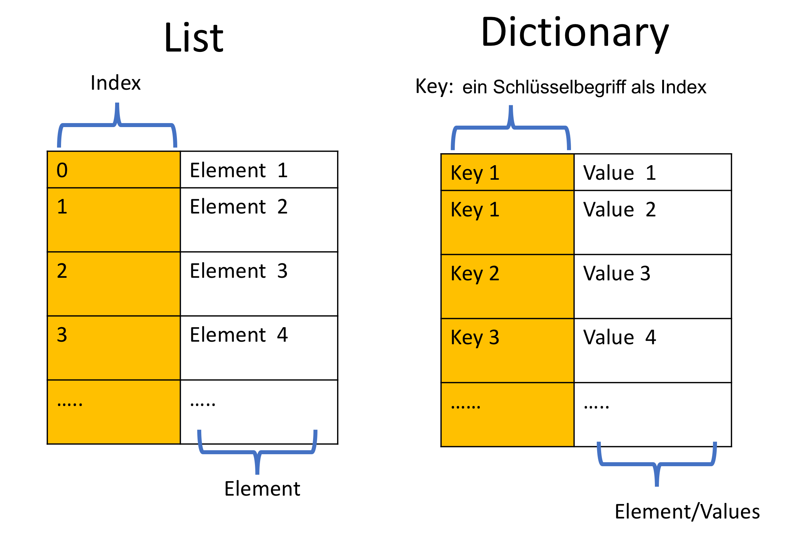

****************
Datenstrukturen
****************

Liste
=====

Eine Liste ("Array") ist eine Datenstruktur, die verwendet wird, um einen beliebigen Datentyp (oder eine
andere Struktur) in geordneter Weise zu speichern. Eine Liste ist die Datenstruktur, die du wahrscheinlich
am häufigsten benutzen wirst. Sagen wir, wir wollen den Punktestand eines Spielers speichern. Wir könnten
eine Liste wie die oben abgebildete verwenden. Die Liste hat eine "Box" für jeden Wert. Die Daten, die in
einer Liste gespeichert sind, werden "Elemente" genannt. 

.. figure:: assets/list_arrow.png 
	 :align: center
     
	 Eine Liste.

Um eine Liste zu erstellen, gibst du ihren Inhalt in eckigen Klammern an und trennst die einzelnen Elemente durch Kommas: :: 

	from microbit import *

	high_scores = [25, 20, 10, 15, 30]      # Erstelle eine Liste und speichere einige Werte in ihr.
	print(high_scores[0])			# Gibt 25 aus
	print(high_scores[3])			# Gibt 15 aus

Den Wert eines der Elemente in einer Liste zu finden ist einfach, solange du im Hinterkopf behältst, dass
Python die Elemente ab '0' zählt. In der ``high_scores`` Liste oben, ist ``high_scores[0]`` 25 und
``high_scores[3]`` ist 15.

Hier kannst du auch sehen, dass auf bestimmte Elemente in einer Liste über ihren Index zugegriffen werden kann.
Außerdem ist es möglich, Listen zu zerschneiden, um nur einen Teil der Liste abhängig vom Index zu erhalten.
Wenn du nur die ersten drei willst, kannst du ``high_scores[0:3]`` schreiben, oder, da wir bei 0 anfangen, können
wir es zu ``high_scores[:3]`` abkürzen. Beachte, dass der rechte Endpunkt immer ausgeschlossen ist, also bezieht
sich der obige "Ausschnitt" auf das mathematische Intervall ``[0,2]``.

Natürlich besitzt Python schon Funktionen für die Arbeit mit Listen. Der folgende Codeschnipsel berechnet die
Summe aller Elemente und berechnet dann den durchschnittlichen Punktestand. ::		

	punkte_gesamt = 0
	
	for punkte in high_scores: 		# Für jedes Element ...
		punkte_gesamt = punkte_gesamt + punkte

	durchschnitt = punkte_gesamt / len(high_scores)  # Die Funktion len() gibt die "Länge" der Liste zurück 

Das Gleiche kann sogar in einer Zeile mit der Funktion ``sum`` gemacht werden::

	durchschnitt_kurzfassung = sum(high_score) / len(high_score)	 

Da du nicht unbedingt weißt, welche Werte in der Liste sein werden, oder wie groß die Liste sein wird, ist es
nützlich, die ``append`` Funktion zu kennen. Du kannst sie zum Beispiel benutzen, um eine Liste mit
Temperaturmesswerten oder Beschleunigungsmessungen zu füllen:: 

	from microbit import *

	temperaturaufzeichnungen = [] 		# Erstelle eine leere Liste
	for i in range(100):			# 100 Temperaturwerte hinzufügen
		temperaturaufzeichnungen.append(temperature())
		sleep(1000)			 

Die ``for`` Schleife wird 100 mal ausgeführt und ``i`` hat Werte von 0 bis 99. Dadurch wird die Temperatur
jede Sekunde für 100 Sekunden gemessen und der Wert an das Ende der Liste angefügt. 

Das Löschen von Elementen aus einer Liste ist genauso einfach::

	high_scores.delete(24)

Dadurch wird das erste Element mit dem Wert 24 gelöscht.
Alternativ kannst du auch ein Element an einer bestimmten Position löschen, wenn du es kennst:: 
 
	high_scores.pop(3)

Dies löscht oder 'poppt' das Element an der angegebenen Position in der Liste. Beachte, dass::

	high_scores.pop() 

das letzte Element in der Liste löscht.

.. tip:: Du kannst hier_ nachschauen, um weitere nützliche Methoden für Listen zu sehen.

.. _hier: https://docs.python.org/2/tutorial/datastructures.html#

.. note:: Du fragst dich vielleicht, ob Strings als Liste betrachtet werden können. Auch wenn ein String ein Array von Zeichen ist und wir sogar ähnliche Operationen mit ihnen durchführen können  
	(wie z.B. Slicing), sind sie beide unterschiedliche Objekttypen mit unterschiedlichen Methoden (versuche ``dir(str)`` und ``dir(list)`` in deiner Konsole einzugeben). 

Sortieren
^^^^^^^^^

Oft wirst du die Daten in deiner Liste sortiert haben wollen, zum Beispiel bei der Implementierung von
Suchalgorithmen. In Python ist es einfach, Listen zu sortieren, indem man die ``sort()`` Funktion verwendet::

	high_scores = [25, 20, 10, 15, 30]
	high_scores.sort()

Du kannst nicht nur Zahlen sortieren - der optionale Parameter ``key=`` erlaubt es dir, deine eigene Funktion für
den Vergleich von Elementen in deiner Liste anzugeben (zum Beispiel, wenn du eine Liste von Strings nach der Länge
sortieren willst, kannst du die Funktion len() als Parameter übergeben). Die Übergabe von false an den Parameter
``reverse=`` erlaubt es dir, in absteigender Reihenfolge zu sortieren. ::

	list = ['länger', 'kurz', 'am längsten']

	# Liste in aufsteigender Reihenfolge der Stringlänge sortieren
	list.sort(key=len)
	# Liste in absteigender Reihenfolge der Stringlänge sortieren
	list.sort(key=len, reverse=True)

Tupel
=======

Tupel sind ähnlich wie Listen, da sie verwendet werden, um eine geordnete Folge von Elementen zu speichern,
die normalerweise einen unterschiedlichen Datentyp haben.::

    high_scores_unveraenderlich = (25, 20, 10, 15, 30)

Du kannst Werte auf die gleiche Weise wie mit Listen abrufen, aber der wichtigste Unterschied ist, dass Tupel
`unveränderlich` sind. Das bedeutet, dass du in der ``high_scores`` Liste oben, den Wert einzelner Elemente
ändern kannst: ::

    high_scores[0] = 42

Der Versuch, einen Wert innerhalb von ``high_scores_unveraenderlich`` zu ändern, gibt jedoch einen
``TypeError: Object tuple does not support item assignment`` zurück. Sobald du Werte 
innerhalb eines Tupels zugewiesen hast, können sie nicht mehr geändert werden. 

Die Veränderbarkeit ist ein weiterer Unterschied zwischen Strings und Listen - während Listen veränderbar
sind, sind es Strings nicht.

Set
====

Im Gegensatz zu Listen und Tupeln, enthalten Sets eine **ungeordnete** Sammlung von Elementen ohne Duplikate.
Das ermöglicht das Testen der Zugehörigkeit oder das Entfernen doppelter Elemente. ::

	set = {8, 12, 22}

	# Ein einzelnes Element zum Set hinzufügen.
	set.add(42)

	# Mehrere Elemente zum Set hinzufügen
	set.update([16, 32, 64])

	# Entferne ein Element aus dem Set - gibt einen Fehler aus, wenn das Element nicht im Set ist 
	set.remove(42)

	# Entferne ein Element wenn es im Set vorhanden ist 
	set.discard(42)

	 

Da ein Set eine ungeordnete Sammlung von Elementen ist, ist eine Indexierung nicht möglich. Python unterstützt
typische Set-Operationsmethoden: ::

	set_a = {1,2,3,4,5}
	set_b = {4,5,6,7}
	set_c = {1,2}

	# Überprüfung auf Zugehörigkeit
	2 in set_a

	# Gib Elemente in der Schnittmenge von set_a und set_b zurück
	set_a.intersection(set_b)
	# Gib true zurück, wenn set_a alle Elemente von set_c enthält
	set_a.issuperset(set_c)

Ein leeres Set wird mit der Methode ``set()`` erzeugt, da die Verwendung von geschweiften Klammern ein leeres
Dictionary erzeugt (siehe unten).  	

Für weitere Methoden, siehe Python Dokumentation_.

.. _Dokumentation: https://docs.python.org/2/library/stdtypes.html#set

.. figure:: assets/sets_i.png
   :align: center

   Alle Elemente innerhalb eines Sets sind einzigartig

Dictionary
===========

Ein Dictionary ist ein ungeordnetes Set von ``Schlüssel : Wert`` Paaren. Es ist eine Regel, dass 
alle Schlüssel eindeutig sind und keine Duplikate haben. Anders als Listen oder Tupel, die durch Zahlen 
indiziert werden, kannst du einen Wert aus einem Dictionary abrufen, indem du den Schlüssel als Index verwendest.

Hier ein Vergleich zwischen ``List`` und ``Dictionary``:

Zum Beispiel kannst du die Highscores aller Spieler auf diese Weise speichern: ::

	game_register = { 'googolplex': 100,
			  'terminat0r': 27,
			  'r00t': 150,
			  'dent': 42,
			  'teapot418' : 0 } 

	# auf Elemente zugreifen
	game_register['dent']

	# Hinzufügen oder aktualisieren eines bestehenden Eintrags
	game_register['pepper'] = 50

	# Einen Eintrag löschen
	del game_register['pepper']	

	# Alle Einträge löschen
	game_register.clear()

	# Das Dictionary löschen
	del game_register

	# Rufe einen Wert für den Schlüssel oder den Standardwert ab, wenn er nicht im Dictionary steht
	game_register.get('dent')		

Übungsaufgaben
===================

1. Verwende die micro:bit Liste ``Image.ALL_CLOCKS`` und durchlaufe alle Elemente in der Liste mit einer for Schleife und zeige sie auf dem LED Bildschirm an.

2. Verwende dieselbe Elementeliste und zeige nur Elemente mit einem durch 3 teilbaren Index.

3. Sortiere eine Integer-Liste (z.B. ``Liste = [20, 112, 45, 80, 23]``) anhand der letzten Ziffer jedes Elements und behalte ihre relativen Positionen bei, falls die Ziffer gleich ist
   (das Ergebnis wäre in diesem Fall ``[20, 80, 112, 23, 45]``).

4. Erstelle eine eigene Animation mit einem Tupel und spiele sie auf dem micro:bit LED Bildschirm ab.

5. Programmiere den microbit so, dass er beim Drücken einer Taste eine Kompassmessung vornimmt und die Ergebnisse in einem Tupel speichert.

6. Schreibe ein Programm, das die Gesten, die der microbit erkennt, und die Anzahl ihrer Erkennung in einem Dictionary festhält. 