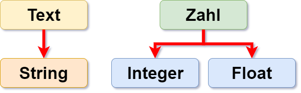
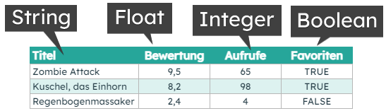

***********
Datentypen
***********

Um verschiedene Arten von Daten korrekt zu erfassen, stellen uns Programmiersprachen verschiedene 
Datentypen zur Verfügung, damit wir diese richtig darstellen und mit ihnen arbeiten können. Jeder 
Fall, sei es das Sammeln von Beschleunigungswerten vom Beschleunigungsmesser, das Zählen, 
wie oft eine Taste gedrückt wurde, oder das Speichern eines Namens, muss auf jeweils ganz spezielle 
Art und Weise behandelt werden. Deshalb stellt Python so wie die meisten anderen Programmiersprachen 
mehrere Datentypen zur Darstellung von Werten zur Verfügung.

Die Wichtigsten sind:

Eine kleine Übersicht mit Beispielen:

+-----------------+------------------------------------------------------+--------------------+
| **Datentyp**    | **Beschreibung**                                     | **Beispiel**       |
+=================+======================================================+====================+
| Integers        | Ganze Zahlen                                         | ``42``             |
+-----------------+------------------------------------------------------+--------------------+
| Floats          | Zahlen mit dem Dezimalpunkt (kein Komma!), Brüche    | ``3.1415``         |
+-----------------+------------------------------------------------------+--------------------+
| Complex numbers | Zahlen mit einem Real und einem Imaginärteil         | ``1 + 3j``         |
+-----------------+------------------------------------------------------+--------------------+
| Strings         | Durch Anführungszeichen begrenzte Zeichenketten      | ``"Hallo Welt!"``  |
+-----------------+------------------------------------------------------+--------------------+
| Booleans        | Werte, die Wahr oder Falsch sein können              | ``False``          |
+-----------------+------------------------------------------------------+--------------------+

Auch in einem einfachen Programm wirst du die meisten dieser Datentypen verwenden. Hier sind zB. 
die Datentypen, die du in einem deiner Programme verwenden könntest, um Informationen über eines 
deiner micro:bit Spiele zu speichern:

Operationen
===========

Jeder Datentyp unterstützt unterschiedliche Operationen. Wie wichtig es ist, dass Python weiß um
welchen Datentypen es sich handelt, kann man zB an dem uns aus der Mathematik bekannten ``+``-Operator
erkennen, der, wie du gleich sehen wirst, ganz unterschiedliche Ergebnisse liefert, je nachdem ob 
Zahlen oder Strings "zusammengezählt" werden.

Zahlen
--------
Grundlegende arithmetische Operatoren: ``+``,  ``-``, ``*`` und ``/`` werden auf die gleiche 
Art und Weise wie bei einem Taschenrechner verwendet. Wenn du zur REPL-Konsole wechselst, könntest 
du beispielsweise folgende Rechnungen nach der Eingabeaufforderung ``>>>`` oder, wenn du mehrere 
Zeilen verwendest, nach  ``...`` eintippen und berechnen lassen: ::

	>>> 2 + 2
	4
	>>> # Dies ist ein Kommentar
	... 2 + 2
	4
	>>> 2 + 2  # und dies ist ein Kommentar in derselben Zeile wie Code
	4
	>>> (50 - 5 * 6) / 4
	5.0
	>>> 8 / 5 # Brüche gehen nicht verloren, wenn man Ganzzahlen teilt
	1.6

Schauen wir uns ein Beispiel an, bei dem mit den arithmetischen Operatoren die vom micro:bit 
gelesene Temperatur von Celsius in Fahrenheit umgerechnet wird::

	celsiusTemp = temperature()
	fahrenheitTemp = celsiusTemp * 9 / 5 + 32  

.. warning:: Python kennt zwei Divisionsoperatoren: ``/`` und ``//``. Der erste gibt das Ergebnis aus, das du erwarten 
	würdest, aber der zweite macht eine ganzzahlige Division: der Rückgabewert ist das Ergebnis ohne Rest. Das bedeutet, 
	dass der Rückgabewert immer nach unten gerundet wird.

Um eine Ganzzahldivision auszuführen, die ein ganzzahliges Ergebnis liefert und den Bruchteil des 
Ergebnisses vernachlässigt, müsstest du also den Operator ``//`` anstatt ``/`` verwenden ::

    >>> # Ganzzahldivision gibt ein abgerundetes Ergebnis zurück:
    ... 7 // 3
    2
    >>> 7 // -3
    -3

Der Operator ``%``, genannt ``mod`` wird benutzt, um den Rest zu berechnen, wenn ein Wert durch einen 
anderen geteilt wird. Zum Beispiel: wenn du wissen willst, ob eine Zahl ungerade oder 
gerade ist, könntest du versuchen, sie durch 2 zu dividieren. Wenn sie gerade ist, dann gibt es keinen Rest::

	zahl = 3
	if zahl % 2 == 0:
	   print("Die Zahl ist gerade")
	else:
	   print("Die Zahl ist ungerade")

Wenn der Rest gleich ``1`` ist, dann wird dieses Programm ``Die Zahl ist ungerade`` ausgeben, andernfalls wird 
es ``Die Zahl ist gerade`` ausgeben. Du könntest dieses Programm auf eine andere Weise schreiben. Menschen denken 
über Aufgaben auf unterschiedliche Art und Weise und keine zwei Programme werden wahrscheinlich gleich sein. 

Strings
--------
Wie bereits erwähnt, sind Strings (``str`` Typ in Python) Zeichenketten, deren Länge nur durch den Speicher 
deines Rechners begrenzt ist. Ein nützlicher Hinweis ist, dass sie mit dem ``+`` Symbol verkettet werden können! ::

	name = "Hugo"
	nachricht = "Gut gemacht " + name + ". Du hast gewonnen!"
	print(nachricht)

In der letzten Zeile werden die Elemente auf der rechten Seite von ``=`` miteinander verkettet und das Ergebnis in die 
Variable namens ``nachricht`` geschrieben. Wenn du diese Zeilen auf der REPL-Konsole eingibst, sollte das so
aussehen: ::

	>>> name = "Hugo"
	>>> nachricht= "Gut gemacht " + name + ". Du hast gewonnen!"
	>>> print(nachricht)
	Gut gemacht Hugo. Du hast gewonnen!
	>>> 

Was wird ausgegeben, wenn du die folgenden Anweisungen eingibst? ::

	>>> a = "1" 
	>>> b = "2"
	>>> summe = a + b
	>>> print(summe)

Hier kannst du sehr gut sehen, dass es für Python einen großen Unterschied macht ob ich Zahlen als Zahlen 
oder als Strings abspeichere und verwende. Hier sind ``a`` und ``b`` Strings und werden dementsprechend
aneinandergefügt und nicht addiert!

Um Zahlen und Strings miteinander zu verbinden, musst du, damit Python nicht durcheinanderkommt, zuerst die Zahl 
mit der Funktion ``str()`` in einen String umwandeln::

	x = temperature
	if temperature < 6:
	   display.scroll("Kalt" + str(temperature))

.. note:: Python stellt von Haus aus eine Menge Methoden_ zur Verfügung, was den Umgang mit Strings sehr vereinfacht 
	und viel Zeit spart (auch wenn die eigene Umsetzung anfangs eine gute Programmierübung sein kann). 

.. _Methoden: https://www.programiz.com/python-programming/methods/string

Booleans
---------
Ein boolescher Wert (boolean bzw. ``bool``) ist ein Wert, der entweder ``True`` oder ``False`` ist, auch dargestellt 
durch `1` und `0`. In Python gibt es eine Reihe von Operationen, die es dir erlauben, boolesche Ausdrücke zu erzeugen.  

Vergleiche
^^^^^^^^^^^^

.. figure:: assets/booleanLogic.jpg 
   :scale: 60 %
   :align: center

   Source: <http://www.bbc.co.uk/education/guides/zy9thyc/revision>

Vergleichsoperationen sind nützlich, um Variablenwerte in bedingten Anweisungen oder Schleifen zu testen. Hier sind 
einige Beispiele für Vergleiche, wie sie im Deutschen geschrieben werden: ::

    	der Punktestand ist größer als 100
	der Name ist gleich "Hugo"
 	die Geschwindigkeit ist ungleich 0

Python hat eine Reihe von Vergleichsoperatoren, die es uns erlauben, Vergleiche einfach zu schreiben:

.. tabularcolumns:: |L|l|

+--------------------------------+----------------------------------------+
| **Vergleichsoperator**         | **Bedeutung**                          |
+================================+========================================+
| ==                             | ist gleich                             |
+--------------------------------+----------------------------------------+
| <, <=                          | Kleiner als, kleiner als oder gleich   |
+--------------------------------+----------------------------------------+
| >, >=                          | Größer als, größer als oder gleich     |
+--------------------------------+----------------------------------------+
| !=                             | ist nicht gleich, ungleich             |
+--------------------------------+----------------------------------------+

Das Umschreiben der obigen Vergleiche in Python würde lauten: ::

	punktestand > 100
	name ==  "Hugo"
 	geschwindigkeit  != 0

Logische Operationen
^^^^^^^^^^^^^^^^^^^^

Logische Operatoren testen den Wahrheitswert ihrer Operanden.

+--------------+----------------------------------+-------------------+
| **Operator** |  **Gibt ``True`` zurück, wenn**  | **Example**       |
+==============+==================================+===================+
| and          |  beide Operanden Wahr sind       | ``True and True`` |
+--------------+----------------------------------+-------------------+
| or           |  Mindestens ein Operand Wahr ist | ``True or False`` |
+--------------+----------------------------------+-------------------+
| not          |  der Operand Falsch ist          | ``not False``     |
+--------------+----------------------------------+-------------------+
	

Zugehörigkeitsoperatoren
^^^^^^^^^^^^^^^^^^^^^^^^

Zugehörigkeitsoperatoren sind nützlich, um das Vorhandensein eines Elements in einer Sequenz zu bestimmen. 

+--------------+-----------------------------------------------------------+--------------------------+
| **Operator** | **Gibt ``True`` zurück, wenn**                            | **Beispiel**             |
+==============+===========================================================+==========================+
|   in         | sich ein Variablenwert in der angegebenen Reihe befindet  | ``x in [1, 2, 3, 4]``    |
+--------------+-----------------------------------------------------------+--------------------------+
| not in       | kein Variablenwert in der angegebenen Liste gefunden wird | ``x not in [1, 2, 3, 4]``|
+--------------+-----------------------------------------------------------+--------------------------+

Boolesche Operationen verwenden
^^^^^^^^^^^^^^^^^^^^^^^^^^^^^^^

Du hast vielleicht schon einige Beispiele verwendet, die so etwas machen. In diesem Beispiel wird der micro:bit 
einen Pfeil anzeigen, der seine Richtung entsprechend der Beschleunigung ändert:: 

	from microbit import *
	
	while True:
	    x_richtung = accelerometer.get_x()

	    if (x_richtung <= 100) and (x_richtung >= 50):
		display.show(Image.ARROW_N)

	    elif x_richtung > 100:
	        display.show(Image.ARROW_E) 
	
	    elif  x_richtung < 50:
	        display.show(Image.ARROW_W) 

	    else:
		display.show(Image.ARROW_S)	 

Übungsfragen
===================

	1. Gib an, ob der Rückgabewert True oder False ist. Wenn False, erkläre warum. 
		Überprüfe danach deine Vermutung auf der REPL-Konsole.

		a) ``"hello" == 'hello'``
		b) ``10 == 10.0``
		c) ``5/2 == 5//2``
		d) ``5 in [x for x in range(0,5)]``
		e) ``0 == False``
		f) ``1 == true``
		g) ``0.1 + 0.2 == 0.3``
		
