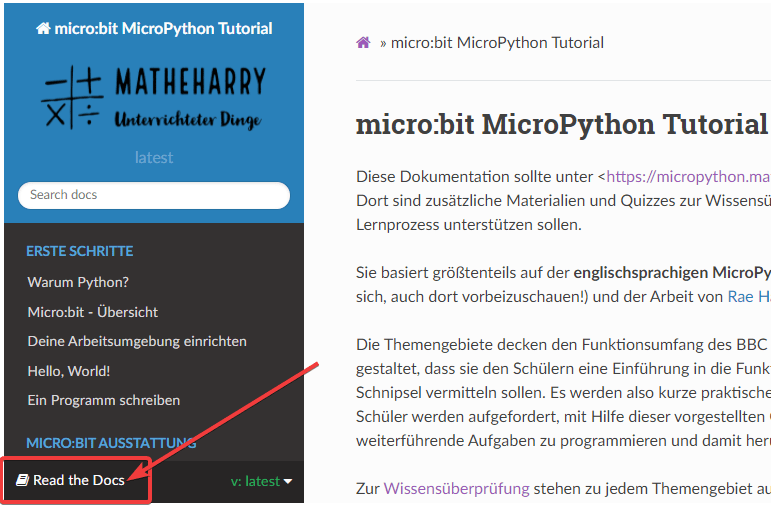

.. microbit_tutorials documentation master file, created by
   sphinx-quickstart on Sat Sep 10 20:23:45 2016.
   You can adapt this file completely to your liking, but it should at least
   contain the root `toctree` directive.

micro:bit MicroPython Tutorial
===============================

Die Tutorials können auf <https://microbit-challenges-de.readthedocs.io/> abgerufen werden. Diese Dokumentation ist auch eingebunden
in die Seite <https://matheharry.github.io/MicroPythonTutorial/>, wo sie um eine Sammlung von interaktiven Quizfragen zur Wissensüberprüfung 
erweitert wurde, die den Lernprozess unterstützen sollen. 

Sie basiert größtenteils auf der **englischsprachigen MicroPython** `Dokumentation <http://microbit-micropython.readthedocs.io>`_ 
(es lohnt sich, auch dort vorbeizuschauen!) und der Arbeit von `Rae Harbird`_. 

.. _Rae Harbird: https://microbit-challenges.readthedocs.io/

Die Themengebiete decken den Funktionsumfang des BBC micro:bit ab und sind so gestaltet, dass 
sie den Schülern eine Einführung in die Funktionen anhand kurzer Code-Schnipsel vermitteln sollen.  
Es werden also kurze praktische Beispiele gegeben und die Schüler werden aufgefordert, mit Hilfe dieser 
vorgestellten Grundbausteine Lösungen für weiterführende Aufgaben zu programmieren und damit 
herumzuexperimentieren.

Zur `Wissensüberprüfung <https://matheharry.github.io/MicroPythonTutorial/check_dein_wissen.html>`_ stehen zu jedem Themengebiet 
auch kleine Quizzes zu Verfügung.

Schülern das Programmieren mit einem Mikroprozessor wie dem micro:bit, der noch dazu mit Sensoren 
ausgestattet ist, beizubringen, ermöglicht es den Lernenden, sofortiges Feedback zu ihrem Code zu erhalten, 
ohne dass sie vorher etwas über Elektronik wissen müssen.

Die Challenge-Aufgaben können für Team-Wettbewerbe oder einfach zum Spaß im Klassenzimmer verwendet werden. Einige von 
ihnen basieren auf Übungen von M. Atkinson auf der großartigen Website `Multiwingspan <http://multiwingspan.co.uk/micro.php>`_ 
und wurden teilweise ein wenig angepasst.

Um diese Dokumentation im pdf-, epub- oder html-Format herunterzuladen, klicke auf den Link *Read the Docs* unten in der 
Seitenleiste auf der linken Seite:

Wenn du zu dieser Sammlung beitragen möchtest, nur zu! Installiere git und erstelle einen Branch. Es wäre 
toll, mehr Challenges und weitere Projekte zu haben.

.. toctree::
   :maxdepth: 1
   :caption: Erste Schritte 

   introduction/python.rst 
   introduction/getting_started.rst 
   introduction/environment.rst
   introduction/hello.rst
   introduction/first_program.rst

.. toctree::
   :maxdepth: 1
   :caption: Micro:bit Ausstattung 

   tutorials/display.rst
   tutorials/buttons.rst
   tutorials/accelerometer.rst
   tutorials/compass.rst
   tutorials/thermometer.rst
   tutorials/music.rst
   tutorials/radio.rst
   tutorials/io.rst
   
.. toctree::
   :maxdepth: 1
   :caption: Grundlagen der Programmierung

   basics/data_types.rst 
   basics/variables.rst
   basics/control_structures.rst
   basics/data_structures.rst
   basics/functions.rst
   basics/functionsii.rst
   basics/classes_objects.rst   
   
.. toctree::
   :maxdepth: 1
   :caption: Challenges
   
   challenges/games/ssp.rst
   
   challenges/crypto/morse.rst 
   challenges/crypto/caesar.rst 
   challenges/crypto/substitution.rst
   challenges/crypto/vigenere.rst

   challenges/games/bop-it.rst
   challenges/games/consonant-or-vowel.rst
   challenges/games/egg-basket.rst
   	  
   challenges/sensors/spirit_level.rst
   challenges/sensors/theremin.rst
   challenges/sensors/radio.rst

.. toctree::
   :maxdepth: 1
   :caption: Verschiedenes

   misc/other_languages.rst 
   misc/cmd.rst
   

.. * :ref:`genindex`
.. * :ref:`modindex`
.. * :ref:`search`
