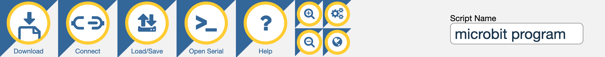
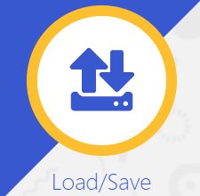
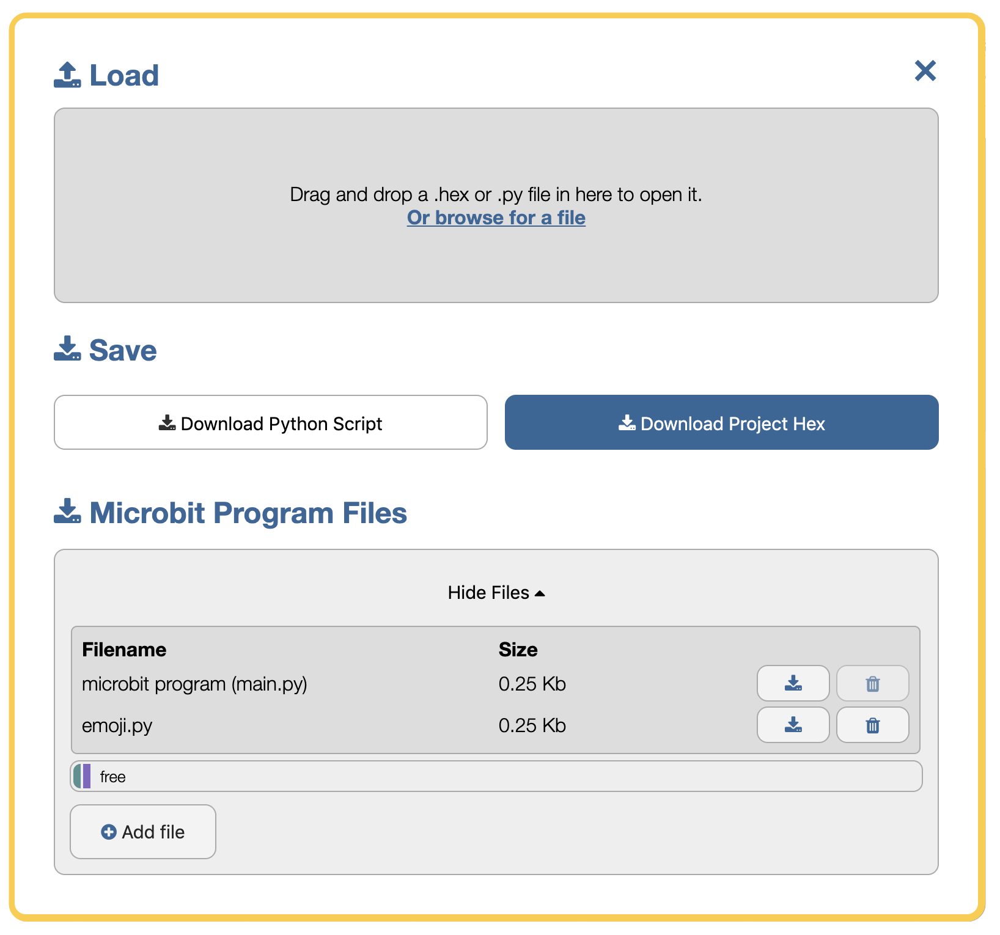
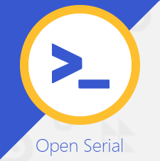
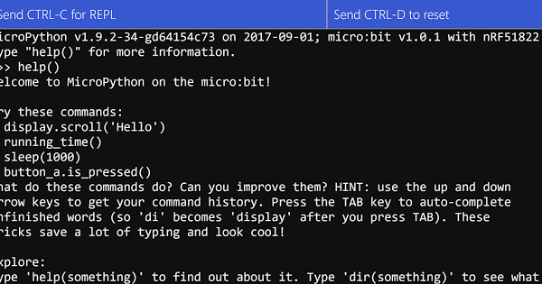
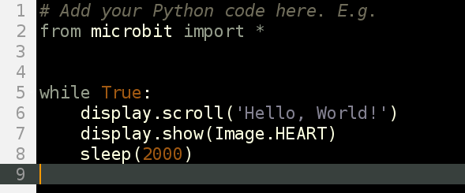

********************************
Deine Arbeitsumgebung einrichten
********************************

Bevor du mit dem Programmieren beginnst, benötigst du einen Quellcode-Editor, um Programme auf deinem micro:bit schreiben, laden und ausführen zu können. 
Es gibt im Wesentlichen vier Optionen: 

    - Im Web-Browser: `micro:bit Editor`_ (momentan empfehle ich allerdings die aktuelle `Beta-Version`_!)
    - Für Anfänger am PC perfekt: der `Mu Editor`_ (unsere erste Wahl)
    - `MicroPython App`_ wenn du ein Chromebook benutzt  
    - Dein normaler Python-Editor mit einer Reihe von CLI-Befehlen (fortgeschritten)  

.. _`micro:bit Editor`: https://python.microbit.org
.. _`Beta-Version`: https://python.microbit.org/v/beta
.. _`Mu Editor`: https://codewith.mu/
.. _`MicroPython App` : https://chrome.google.com/webstore/detail/micropython/lhdjeebhcalhgnbigbngiaglmladclbo?hl=de-GE

Mu Editor verwenden
===================

Für dieses Tutorial werden wir den Mu-Editor verwenden, aber du kannst natürlich auch einen anderen Editor verwenden, der dir besser gefällt.
Um Mu herunterzuladen, gehe auf die Mu Website_. Hier steht eine `Schritt-für-Schritt-Anleitung`_ zur Verfügung.

.. _`Schritt-für-Schritt-Anleitung`: https://docs.google.com/document/d/1S5etlP-8M21CJGMawijKD00qzNokz1waKBrlP2ujO74/edit?usp=sharing
.. _Website: https://codewith.mu/en/

Du kannst verschiedene Optionen wählen, um Mu zu installieren. Die, die du höchstwahrscheinlich auf deinem eigenen Gerät benutzen wirst, 
wenn du Administratorenrechte hast, ist ein Installer für dein Gerät (Mac/Windows), oder die Installation durch ein
Python-Paket (pip) über die :ref:`Kommandozeile`, wenn du Python auf deinem Computer installiert hast.

Falls du keine Administratorenrechte besitzt und Python auf deinem Gerät nicht installiert ist, bietet sich die portable Version *PortaMu* an. 
Diese muss man einfach in einen Ordner entpacken und hat damit sofort eine anfängerfreundliche Programmierumgebung zur Verfügung, die ohne Installation 
auf allen Geräten funktioniert.

.. figure:: assets/installation_options.PNG
   :align: center
   :scale: 70% 
   :target: https://codewith.mu/en/download

Sobald der Editor installiert ist, starte ihn und schließe den micro:bit an deinen Computer an.

.. note:: Für diejenigen, die vorher mit Python gearbeitet haben, MicroPython unterstützt keine 
    regulären externen Python-Bibliotheken, da viele zu groß für ein Embedded Gerät sind. Allerdings 
    wurde ein Subset speziell für die `MicroPython-Umgebung`_ neu erstellt. 

.. _`MicroPython-Umgebung`: https://docs.micropython.org/en/latest/library/index.html

Web Editor verwenden
====================

Ein einfacher `browserbasierter Code-Editor`_, der Lehrern und Lernenden hilft, die textbasierte Programmierung 
auf dem micro:bit optimal zu nutzen. Der Python-Editor ist perfekt für alle, die ihre Coding-Fähigkeiten weiter 
ausbauen wollen. Eine Auswahl an Snippets und eine Reihe von vorgefertigten Bildern, Sounds und Musik unterstützen 
dich bei der Programmierung.

.. _`browserbasierter Code-Editor`: https://python.microbit.org/v/beta

Menü
-----

Das Hauptmenü des Editors enthält verschiedene Buttons, mit denen du mit dem Editor und dem micro:bit arbeiten kannst. 
Wenn du zusätzliche Funktionen im Editor aktiviert hast, wie z.B. WebUSB, kannst du zusätzliche Buttons in diesem Menü 
sehen.

Klicke auf den Download Button, um eine spezielle "hex"-Datei auf dem Computer zu speichern.

Schließe den BBC micro:bit an (er wird als USB-Speicher angezeigt) und ziehe die neu gespeicherte 
Datei auf das Gerät. Der Code wird ausgeführt (oder du wirst eine Fehlermeldung auf dem Display des 
Geräts sehen). Weiter unten erfährst du, wie du den Code aus einer Hex-Datei zurück in den Editor bekommst.

Der Download- wird zum Flash-Button, wenn der micro:bit über WebUSB verbunden ist. 

.. figure:: assets/webeditor_flash.png
   :align: left
   :scale: 50% 

Schreibe dein Skript im Editorfenster und klicke auf den "Flash" Button, um es direkt auf den micro:bit 
zu übertragen. 

Wenn das nicht funktioniert, stelle sicher, dass dein micro:bit als USB-Speichergerät in 
deinem Dateisystem-Explorer aufscheint.

Der Connect-Button ermöglicht es dir, deinen micro:bit mit deinem Browser zu verbinden, indem du ein Tool 
namens WebUSB benutzt. Wenn du eine Verbindung herstellst, öffnet sich ein Fenster in deinem Browser, in dem 
du den micro:bit auswählen kannst. Wenn du die Meldung "no compatible devices found" siehst, musst du möglicherweise 
die micro:bit Firmware aktualisieren.

Du kannst nicht nur eine Hex-Datei oder ein Py-Skript per Drag&Drop in den Editor ziehen, um sie zu laden, sondern 
auch den Load/Save Button drücken, um ein Dateifenster zu öffnen, in dem du die Dateien auf dem micro:bit überprüfen 
kannst. Du kannst Dateien per Drag&Drop in die graue "Drop"-Fläche ziehen oder mit dem Dateipicker nach einer Datei 
auf deinem Computer suchen. Du kannst auch deine .hex oder .py Dateien von hier aus herunterladen.

Das Dateisystem fügt Funktionen hinzu, um Python-Module, Datenlogs und andere Dateitypen auf dem micro:bit abzuspeichern 
oder zu entfernen.

Read, Evaluate, Print Loop (REPL)
+++++++++++++++++++++++++++++++++

Der Open/Close Serial Button erlaubt es dir, dynamisch mit MicroPython auf dem micro:bit zu arbeiten, indem du die 
REPL-Befehlszeile benutzt.

    1. Lies die Benutzereingabe
    2. Überprüfe den Code
    3. Gib das Ergebnis aus
    4. Gehe in der Schleife zurück zu Schritt 1

Text-Editor
+++++++++++

Im Texteditor schreiben und bearbeiten wir unsere Skripte. Der Texteditor versucht zu helfen, indem er 
den Text einfärbt, um zu zeigen, was die verschiedenen Teile des Programms sind. Zum Beispiel sind die 
Python-Schlüsselwörter (Wörter, die in die Python-Sprache eingebaut sind) grau. Die heller gefärbten Wörter 
sind Teile des Programms, das du erstellt hast. Braune Wörter sind konstante Werte, die sich nie ändern und 
lila Wörter stellen Zeichenketten dar, die angezeigt werden sollen. Alle Zeilen sind nummeriert, wobei die 
aktuelle Zeile hervorgehoben ist.

**Autovervollständigung (Autocomplete)**

Die Autovervollständigung gibt dir während der Eingabe Vorschläge für deinen Python-Code, damit du besser 
verstehst, welche Funktionen dir zur Verfügung stehen. Das ist eine große Hilfe um Tippfehler zu vermeiden und 
funktionierende Programme zu erstellen.

Drücke die TAB-Taste auf deiner Tastatur, um die aktuelle Eingabe automatisch zu vervollständigen.