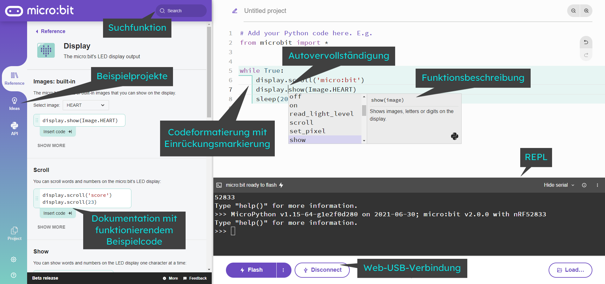

********************************
Deine Arbeitsumgebung einrichten
********************************

Bevor du mit dem Programmieren beginnst, benötigst du einen Quellcode-Editor, um Programme für den micro:bit
schreiben, laden und ausführen zu können. Es gibt im Wesentlichen drei Optionen: 

* den `micro:bit Web-Editor`_ (wer am neuesten Stand sein will kann auch die `Beta-Version`_ verwenden!)
* den `Mu Editor`_ am PC (vor allem wenn man sich über den micro:bit hinaus mit Python beschäftigen möchte!)
* die `MicroPython App`_ am Chromebook

.. _`micro:bit Web-Editor`: https://python.microbit.org
.. _`Beta-Version`: https://python.microbit.org/v/beta
.. _`Mu Editor`: https://codewith.mu/
.. _`MicroPython App`: https://chrome.google.com/webstore/detail/micropython/lhdjeebhcalhgnbigbngiaglmladclbo?hl=de-GE

Web Editor
==========

Der neue  `browserbasierter Code-Editor`_ wurde von Grund auf mit Blick auf den Einsatz im Unterricht entwickelt. Er soll
den Zugang zum textbasierten Programmieren auch für Schülerinnen und Schüler, die mit dem Thema Coding wenig anzufangen wissen,
leichter machen, indem **bekannte Lernbarrieren beseitigt** wurden. Er bietet bei jedem Schritt auf den micro:bit zugeschnittene
Hilfen an und ist für unterschiedlichste Jahrgänge perfekt geeignet.

Um den Editor zu verwenden, den `Link unbedingt in einem neuen Tab öffnen <https://python.microbit.org/v/beta>`__  
(per Rechtsklick).

.. _`browserbasierter Code-Editor`: https://python.microbit.org/v/beta

Funktionierende Code-Beispiele und Code-Referenz durchsuchen
++++++++++++++++++++++++++++++++++++++++++++++++++++++++++++

Wenn du mit der textbasierten Programmierung beginnst, ist es oft schwer zu wissen, was genau du eingeben musst.

Im Abschnitt "Referenz" findest du Beispiele für funktionierenden Code, den du per Drag & Drop in den Editor ziehen und
sofort verwenden kannst. Das fördert unabhängiges und kreatives Lernen, indem es das Entdecken und Anwenden von
micro:bit-Funktionen und grundlegenden Computerkonzepten wie Schleifen, Variablen und Entscheidungsstrukturen erleichtert.

Diese Auswahl an Codeschnipseln und eine Reihe von vorgefertigten Bildern, Sounds und Musik sorgen so von Anfang an 
für Abwechslung und Spaß bei der Programmierung.

Intelligente Autovervollständigung
+++++++++++++++++++++++++++++++++++

Die Autovervollständigungsfunktion zeigt dir während der Eingabe gültige Optionen an, damit du dich nicht an die genaue
Syntax jedes Befehls erinnern musst. Die in einem DropDown-Menü erscheinden Vorschläge können mittels ENTER-Taste 
übernommen werden.

Fehlererkennung
+++++++++++++++

Der Editor zeigt auch potenzielle Fehler an, z. B. Variablen oder Funktionen, die nicht definiert wurden, oder Code, der
nicht erreichbar ist. Das kann helfen, einfache Tippfehler zu erkennen, bevor du den Code auf einen micro:bit überträgst.

Normalerweise werden Fehler in Python erst bei der Ausführung erkannt und angezeigt, weshalb diese Funktion einen
Vorteil zum :ref:`Mu-Editor` darstellt.

Codeformatierung
++++++++++++++++

Einrückungen spielen in Python eine zentrale Rolle und können am Anfang leicht zu Fehlern bei der Eingabe führen.
Deshalb verfügt der Webeditor über eine Linien- und Farbhervorhebung, die dir zeigt, wo und wie der Code eingerückt
werden sollte, damit du deinen Code leichter korrigieren kannst.

Menü
+++++

Das Hauptmenü des Editors enthält verschiedene Buttons, um deinen Code auf dem micro:bit ausführen zu lassen. 

Zuerst musst du den micro:bit mit dem Computer und dem Editor mittels USB-Kabel verbinden. Du findest die 
Verbindungsschaltfläche, wenn du die 3 Punkte neben dem ``Send to micro:bit`` - Button anklickst und ``Connect`` auswählst.

Du wirst dann Schritt für Schritt durch den Verbindungsprozess geführt - beachte die sich öffnenden Fenster mit der Anleitung!

Wenn alles funktioniert hat siehst du folgendes Menü:

Schreibe dein Skript im Editorfenster und klicke auf den ``Send to micro:bit`` Button, um es direkt auf den micro:bit 
zu übertragen. 

Wenn das nicht funktioniert, stelle sicher, dass dein micro:bit als USB-Speichergerät in 
deinem Dateisystem-Explorer aufscheint.

Klicke auf den ``Save`` Button, um deine "hex"-Datei auf dem Computer zu speichern. Über das 3-Punkte-Menü 
kann auch der Python-Code gespeichert werden.

Mittels ``Open...`` Button kann eine hex- oder Python-Datei hochgeladen und geöffnet werden.

REPL-Befehlszeile
+++++++++++++++++

Der Webeditor erlaubt die Verwendung einer REPL-Konsole über den ``Show Serial`` Button, um Befehle direkt auf
dem micro:bit ausführen zukönnen.

.. figure:: assets/microbiteditor-serial.png
   :align: center
   :scale: 50%

Dazu wird die sogenannte REPL - Konsole (Read, Evaluate, Print Loop) gestartet, die es dir erlaubt, direkt mit
MicroPython auf dem micro:bit selbst zu arbeiten. Dort kannst du Befehle der Reihe nach eingeben. 
Wie der Name sagt, handelt es sich dabei um eine dauerhaft ausgeführte Schleife, die folgendermaßen abläuft, um 
den auf der Kommandoze eingegebenen Python-Code auszuführen: 

    1. lesen     ( R ead): Lies die Benutzereingabe
    2. auswerten ( E valuate): Überprüfe den Code und führe ihn aus
    3. ausgeben  ( P rint): Gib das Ergebnis aus
    4. Schleife ausführen ( L oop): Gehe in der Schleife zurück zu Schritt 1

So wird es dir ganz einfach gemacht, Befehle auszuprobieren und herumzuexperimentieren! Außerdem werden Fehlermeldungen
auf der REPL-Konsole ausgegeben und erleichtern so das Debuggen (so nennt man die Fehlersuche).

Text-Editor
+++++++++++

Der Texteditor versucht zu helfen, indem er den Text einfärbt, um zu zeigen, was die 
verschiedenen Teile des Programms sind. Zum Beispiel sind die Python-Schlüsselwörter 
(Wörter, die in die Python-Sprache eingebaut sind) lila. Konstante Werte werden grün 
dargestellt und rote Schrift stellt Zeichenketten (Strings) dar. 

Alle Zeilen sind nummeriert, wobei die aktuelle Zeile hervorgehoben ist.

Zusammengehörige, eingerückte Blöcke werden außerdem markiert, was die Struktur des Codes 
herausstreicht und gerade in Python eine wichtige Rolle beim Auffinden von Fehlern spielt.

.. note:: Für diejenigen, die vorher mit Python gearbeitet haben: MicroPython unterstützt keine 
    regulären externen Python-Bibliotheken, da viele zu groß für ein Embedded Gerät sind. Allerdings 
    wurde ein Subset speziell für die `MicroPython-Umgebung`_ neu erstellt. 

.. _`MicroPython-Umgebung`: https://docs.micropython.org/en/latest/library/index.html

Mu Editor
=========

Der Editor Mu richtet sich speziell an Programmieranfänger und war bis vor kurzem noch 
die komfortabelste Möglichkeit, Pythonprogramme für den micro:bit zu erstellen. Inzwischen 
ist der Web-Editor schon so ausgereift, dass Mu eigentlich nicht mehr unbedingt benötigt wird. 

Da Mu aber über die micro:bit-Programmierung weit hinausgeht und sogar die Entwicklung einfacher 
Computerspiele mittels **PyGame** unterstützt, soll er hier als weiterführende Alternative wärmstens 
empfohlen werden.

Um Mu herunterzuladen, gehe auf die Mu Website_. Hier steht eine `Schritt-für-Schritt-Anleitung`_
zur Verfügung.

.. _`Schritt-für-Schritt-Anleitung`: https://micropython.matheharry.de/installation_der_entwicklungsumgebung.html?nav=false
.. _Website: https://codewith.mu/en/

Du kannst verschiedene Optionen wählen, um Mu zu installieren. Die, die du höchstwahrscheinlich auf deinem eigenen Gerät benutzen wirst, 
wenn du Administratorenrechte hast, ist ein Installer für dein Gerät (Mac/Windows), oder die Installation durch ein
Python-Paket (pip) über die :ref:`Kommandozeile`, wenn du Python schon auf deinem Computer installiert hast.

Falls du keine Administratorenrechte besitzt und Python auf deinem Gerät nicht installiert ist, bietet sich die portable Version *PortaMu* an. 
Diese muss man einfach in einen Ordner entpacken und hat damit sofort eine anfängerfreundliche Programmierumgebung zur Verfügung, die ohne Installation 
auf allen Geräten funktioniert. (Momentan ist leider **keine portable Version verfügbar!**)

.. figure:: assets/installation_options.PNG
   :align: center
   :scale: 70% 
   :target: https://codewith.mu/en/download

Sobald der Editor installiert ist, starte ihn und schließe den micro:bit an deinen Computer an. Mu erkennt ihn automatisch und du
kannst sofort loslegen.

REPL
+++++
Der Button **REPL** (Read, Evaluate, Print Loop) erlaubt es dir, dynamisch mit MicroPython auf dem micro:bit zu arbeiten, indem du 
die REPL-Befehlszeile direkt auf deinem micro:bit benutzt und Befehle der Reihe nach eingibst. 

    1. LESEN (read): Lies die Benutzereingabe
    2. AUSWERTEN (evaluate): Überprüfe den Code und führe ihn aus
    3. AUSGEBEN (print): Gib das Ergebnis aus
    4. SCHLEIFE (loop): Gehe in der Schleife zurück zu Schritt 1

So wird es dir ganz einfach gemacht, Befehle auszuprobieren und herumzuexperimentieren! Außerdem werden Fehlermeldungen
auf der REPL-Konsole ausgegeben und erleichtern so das Debuggen (so nennt man die Fehlersuche)