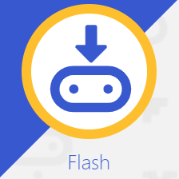

********************************
Deine Arbeitsumgebung einrichten
********************************

Bevor du mit dem Programmieren beginnst, benötigst du einen Quellcode-Editor, um Programme auf deinem micro:bit
schreiben, laden und ausführen zu können. Es gibt im Wesentlichen drei Optionen: 

* der `micro:bit Web-Editor`_ (wer am neuesten Stand sein will kann auch die `Beta-Version`_ verwenden!)
* am PC: der `Mu Editor`_ (vor allem wenn man sich über den micro:bit hinaus mit Python beschäftigen möchte!)
* am Chromebook: die `MicroPython App`_   

.. _`micro:bit Web-Editor`: https://python.microbit.org
.. _`Beta-Version`: https://python.microbit.org/v/beta
.. _`Mu Editor`: https://codewith.mu/
.. _`MicroPython App`: https://chrome.google.com/webstore/detail/micropython/lhdjeebhcalhgnbigbngiaglmladclbo?hl=de-GE

Mu Editor verwenden
===================

Für dieses Tutorial werden wir mit dem Mu-Editor arbeiten, aber du kannst natürlich auch einen der anderen Editor verwenden.

Um Mu herunterzuladen, gehe auf die Mu Website_. Hier steht eine `Schritt-für-Schritt-Anleitung`_
zur Verfügung.

.. _`Schritt-für-Schritt-Anleitung`: https://micropython.matheharry.de/installation_der_entwicklungsumgebung.html?nav=false
.. _Website: https://codewith.mu/en/

Du kannst verschiedene Optionen wählen, um Mu zu installieren. Die, die du höchstwahrscheinlich auf deinem eigenen Gerät benutzen wirst, 
wenn du Administratorenrechte hast, ist ein Installer für dein Gerät (Mac/Windows), oder die Installation durch ein
Python-Paket (pip) über die :ref:`Kommandozeile`, wenn du Python schon auf deinem Computer installiert hast.

Falls du keine Administratorenrechte besitzt und Python auf deinem Gerät nicht installiert ist, bietet sich die portable Version *PortaMu* an. 
Diese muss man einfach in einen Ordner entpacken und hat damit sofort eine anfängerfreundliche Programmierumgebung zur Verfügung, die ohne Installation 
auf allen Geräten funktioniert. (Momentan ist leider **keine portable Version verfügbar!**)

.. figure:: assets/installation_options.PNG
   :align: center
   :scale: 70% 
   :target: https://codewith.mu/en/download

Sobald der Editor installiert ist, starte ihn und schließe den micro:bit an deinen Computer an. Mu erkennt ihn automatisch und du
kannst sofort loslegen.

REPL
+++++
Der Button **REPL** (Read, Evaluate, Print Loop) erlaubt es dir, dynamisch mit MicroPython auf dem micro:bit zu arbeiten, indem du 
die REPL-Befehlszeile direkt auf deinem micro:bit benutzt und Befehle der Reihe nach eingibst. 

    1. LESEN (read): Lies die Benutzereingabe
    2. AUSWERTEN (evaluate): Überprüfe den Code und führe ihn aus
    3. AUSGEBEN (print): Gib das Ergebnis aus
    4. SCHLEIFE (loop): Gehe in der Schleife zurück zu Schritt 1

So wird es dir ganz einfach gemacht, Befehle auszuprobieren und herumzuexperimentieren! Außerdem werden Fehlermeldungen
auf der REPL-Konsole ausgegeben und erleichtern so das Debuggen (so nennt man die Fehlersuche)

Web Editor verwenden
====================

Der neue  `browserbasierter Code-Editor`_ wurde von Grund auf mit Blick auf den Einsatz im Unterricht entwickelt. Er soll
den Zugang zum textbasierten Programmieren auch für Schülerinnen und Schüler, die mit dem Thema Coding wenig anzufangen wissen,
leichter machen, indem **bekannte Lernbarrieren beseitigt** wurden. Er bietet bei jedem Schritt auf den micro:bit zugeschnittene
Hilfen an und ist für unterschiedlichste Jahrgänge perfekt geeignet.

.. figure:: assets/webeditorneu.png
   :align: center

Um den Editor zu verwenden, den `Link unbedingt in einem neuen Tab öffnen <https://python.microbit.org/v/beta>`__  
(per Rechtsklick).

.. _`browserbasierter Code-Editor`: https://python.microbit.org/v/beta

Funktionierende Code-Beispiele und Code-Referenz durchsuchen
++++++++++++++++++++++++++++++++++++++++++++++++++++++++++++

Wenn du mit der textbasierten Programmierung beginnst, ist es oft schwer zu wissen, was genau du eingeben musst.

Im Abschnitt "Referenz" findest du Beispiele für funktionierenden Code, den du per Drag & Drop in den Editor ziehen und
sofort verwenden kannst. Das fördert unabhängiges und kreatives Lernen, indem es das Entdecken und Anwenden von
micro:bit-Funktionen und grundlegenden Computerkonzepten wie Schleifen, Variablen und Entscheidungsstrukturen erleichtert.

Diese Auswahl an Codeschnipseln und eine Reihe von vorgefertigten Bildern, Sounds und Musik sorgen so von Anfang an 
für Abwechslung und Spaß bei der Programmierung.

Intelligente Autovervollständigung
+++++++++++++++++++++++++++++++++++

Die Autovervollständigungsfunktion zeigt dir während der Eingabe gültige Optionen an, damit du dich nicht an die genaue
Syntax jedes Befehls erinnern musst.

Fehlererkennung
+++++++++++++++

Der Editor zeigt auch potenzielle Fehler an, z. B. Variablen oder Funktionen, die nicht definiert wurden, oder Code, der
nicht erreichbar ist. Das kann helfen, einfache Tippfehler zu erkennen, bevor du den Code auf einen micro:bit überträgst.

Normalerweise werden Fehler in Python erst bei der Ausführung erkannt und angezeigt, weshalb diese Funktion einen
Vorteil zum **Mu-Editor** darstellt.

Codeformatierung
++++++++++++++++

Einrückungen spielen in Python eine zentrale Rolle und können am Anfang leicht zu Fehlern bei der Eingabe führen.
Deshalb verfügt der Webeditor über eine Linien- und Farbhervorhebung, die dir zeigt, wo und wie der Code eingerückt
werden sollte, damit du deinen Code leichter korrigieren kannst.

.. note:: Der Web-Editor wurde nun grundlegend verändert und verbessert. Die Beschreibung hier bezieht sich auf die
   aktuelle Web-Version, allerdings sollte unbedingt die oben verlinkte Beta-Version verwendet werden!

   Die Beschreibung wird angepasst ...

Menü
+++++

.. figure:: assets/header.png
   :align: center
   :scale: 30% 

Das Hauptmenü des Editors enthält verschiedene Buttons, mit denen du mit dem Editor und dem micro:bit arbeiten kannst. 
Wenn du zusätzliche Funktionen im Editor aktiviert hast, wie z.B. WebUSB, kannst du zusätzliche Buttons in diesem Menü 
sehen.

.. figure:: assets/webeditor_download.png
   :align: left
   :scale: 50% 

Klicke auf den Download Button, um eine spezielle "hex"-Datei auf dem Computer zu speichern.

Schließe den BBC micro:bit an (er wird als USB-Speicher angezeigt) und ziehe die neu gespeicherte 
Datei auf das Gerät. Der Code wird ausgeführt (oder du wirst eine Fehlermeldung auf dem Display des 
Geräts sehen). Weiter unten erfährst du, wie du den Code aus einer Hex-Datei zurück in den Editor bekommst.

Der Download- wird zum Flash-Button, wenn der micro:bit über WebUSB verbunden ist. 

Schreibe dein Skript im Editorfenster und klicke auf den "Flash" Button, um es direkt auf den micro:bit 
zu übertragen. 

Wenn das nicht funktioniert, stelle sicher, dass dein micro:bit als USB-Speichergerät in 
deinem Dateisystem-Explorer aufscheint.

Der Connect-Button ermöglicht es dir, deinen micro:bit mit deinem Browser zu verbinden, indem du ein Tool 
namens WebUSB benutzt. Wenn du eine Verbindung herstellst, öffnet sich ein Fenster in deinem Browser, in dem 
du den micro:bit auswählen kannst. Wenn du die Meldung "no compatible devices found" siehst, musst du möglicherweise 
die micro:bit Firmware aktualisieren.

.. figure:: assets/webeditor_loadsave.png
   :align: left
   :scale: 50% 

Du kannst nicht nur eine Hex-Datei oder ein Py-Skript per Drag&Drop in den Editor ziehen, um sie zu laden, sondern 
auch den Load/Save Button drücken, um ein Dateifenster zu öffnen, in dem du die Dateien auf dem micro:bit überprüfen 
kannst. Du kannst Dateien per Drag&Drop in die graue "Drop"-Fläche ziehen oder mit dem Dateipicker nach einer Datei 
auf deinem Computer suchen. Du kannst auch deine .hex oder .py Dateien von hier aus herunterladen.

.. figure:: assets/file-system.png
   :align: center
   :scale: 30% 

Das Dateisystem fügt Funktionen hinzu, um Python-Module, Datenlogs und andere Dateitypen auf dem micro:bit abzuspeichern 
oder zu entfernen.

REPL-Befehlszeile
+++++++++++++++++

Auch der Webeditor erlaubt die Verwendung einer REPL-Konsole über den Open/Close Serial Button, um Befehle direkt auf
dem micro:bit ausführen zukönnen-

Text-Editor
+++++++++++

Im Texteditor schreiben und bearbeiten wir unsere Skripte. Der Texteditor versucht zu helfen, indem er 
den Text einfärbt, um zu zeigen, was die verschiedenen Teile des Programms sind. Zum Beispiel sind die 
Python-Schlüsselwörter (Wörter, die in die Python-Sprache eingebaut sind) grau. Die heller gefärbten Wörter 
sind Teile des Programms, das du erstellt hast. Braune Wörter sind konstante Werte, die sich nie ändern und 
lila Wörter stellen Zeichenketten dar, die angezeigt werden sollen. Alle Zeilen sind nummeriert, wobei die 
aktuelle Zeile hervorgehoben ist.

**Autovervollständigung (Autocomplete)**

Die Autovervollständigung gibt dir während der Eingabe Vorschläge für deinen Python-Code, damit du besser 
verstehst, welche Funktionen dir zur Verfügung stehen. Das ist eine große Hilfe um Tippfehler zu vermeiden und 
funktionierende Programme zu erstellen.

Drücke die TAB-Taste auf deiner Tastatur, um die aktuelle Eingabe automatisch zu vervollständigen.

.. note:: Für diejenigen, die vorher mit Python gearbeitet haben: MicroPython unterstützt keine 
    regulären externen Python-Bibliotheken, da viele zu groß für ein Embedded Gerät sind. Allerdings 
    wurde ein Subset speziell für die `MicroPython-Umgebung`_ neu erstellt. 

.. _`MicroPython-Umgebung`: https://docs.micropython.org/en/latest/library/index.html
