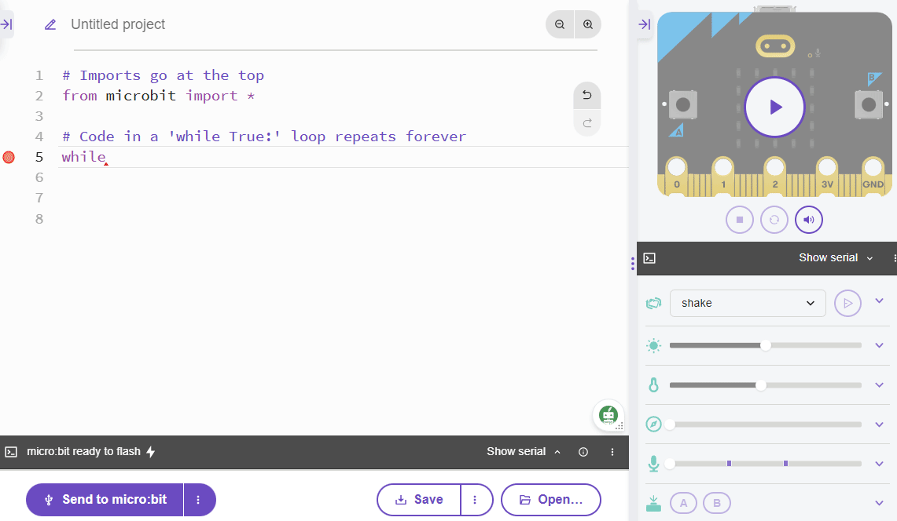

**********************
Ein Programm schreiben
**********************

Im Allgemeinen besteht der Prozess des Code-Entwurfs aus diesen 4 Schritten. Du kannst davon ausgehen, 
dass du die Schleife ein paar Mal durchlaufen musst, bevor dein Code funktioniert.

.. image:: assets/microbit_lifecycle.jpg
   :scale: 70%   
   :align: center

Den Code entwerfen (Design & Edit)
----------------------------------

Als erstes wirst du ein Programm schreiben, das die Nachricht "Hallo Welt!" gefolgt von einem Bild auf dem Display 
deines micro:bit anzeigt und "Hallo du" auf der Mu Konsole ausgibt. 
Es ist ratsam, darüber nachzudenken, was du mit deinem Code erreichen willst und wie du es erreichen willst, 
bevor du mit dem Schreiben beginnst. Es gibt hier nicht viel an Planung und Entwurf zu leisten,
aber nur, damit du verstehst, wie so ein Plan aussehen könnte::

    Für immer wiederholen:
      Scrolle "Hallo Welt!" über das LED Display
      Ein Herzsymbol anzeigen 
      Gib "Hallo du!" auf der Konsole aus
      Für zwei Sekunden warten

Es gibt zwei Möglichkeiten, die Ausgabe deines Codes anzuzeigen: Entweder du nutzt die auf dem micro:bit verfügbaren 
Ausgaben (z.B. die LEDs) oder die REPL (Read Print Evaluate Loop) Konsole, die im Editor mit der ``print`` Anweisung 
verfügbar ist. Die Konsole ist besonders nützlich, um Bugs (Fehler) in deinem Code zu finden oder
neue Konzepte oder Ideen auszuprobieren.  

Gehen wir das Zeile für Zeile durch::

    from microbit import *

Der Import von Paketen (wie microbit) in Python ermöglicht es uns, Funktionen oder Objekte zu verwenden, die in reinem Python nicht definiert sind. In diesem Fall ist es zum Beispiel ``display`` oder ``show``. ::     

	while True: 

In diesem Fall soll etwas (was auch immer dieser Anweisung folgt und eingerückt ist) ausgeführt werden, während die Bedingung, die auf ``While`` folgt, wahr ist. In diesem Fall ist die Bedingung das Schlüsselwort ``True``, 
was bedeutet, dass diese Schleife ewig weiterläuft - es ist dasselbe, als wenn du (5 > 1) schreibst, was am Ende natürlich immer zu ``True``, also Wahr, ausgewertet wird.  
Der Rest des Programms ist ganz einfach::

	from microbit import *

	while True:
            display.show('Hallo Welt!')
         display.show(Image.HEART)
	      print('Hallo du!')    
    	   sleep(2000)
      
Es wird ``Hallo Welt!`` und dann das Herz auf dem LED Display angezeigt. 
Die Anweisung ``print('Hallo du!')``, gibt die Nachricht in der REPL aus. Drücke nun die REPL Taste im Menü, um das REPL Fenster anzuzeigen:

.. image:: assets/mu_repl_bar.png
   :scale: 70%
   :align: center

Das REPL-Fenster zeigt uns Nachrichten vom micro:bit an und erlaubt uns auch, Befehle direkt an den micro:bit zu senden. Für den Moment werden wir die REPL nur benutzen 
um Nachrichten und Fehlermeldungen zu sehen, die wir mit dem ``print``-Befehl ausgeben. 

Programm hochladen (Flash)
--------------------------

Klicke nun auf die Flash-Taste in Mu und schau was passiert.

Das Ergebnis auf dem micro:bit sollte in etwa so aussehen:

.. image:: assets/example_program.gif
   :scale: 40% 
   :align: center

Versuche nun, die REPL-Konsole zu öffnen:

.. image:: assets/first_program_console.png 

Etwas ändern 
-------------

Der beste Weg, um zu lernen, wie etwas funktioniert, ist zu versuchen, den Code ein wenig zu verändern, um zu sehen was dann passiert.
Und die *Dokumentation zu lesen*, um zu sehen, was alles möglich, gehört natürlich auch zum Alltag von Programmierern.

                                    <\|°_°\|>

**Fragen, die du dir stellen könntest:**

   - Wozu ist die Verzögerung (``sleep()``) da? Ist sie notwendig? Versuche einmal sie zu entfernen.
   - Was passiert, wenn du ``True`` durch ``False`` ersetzt?
   - Was passiert, wenn du ``scroll()`` durch ``show()`` ersetzst?

Nun hast du dein erstes Programm geschrieben und damit herumexperimentiert. In den nächsten Abschnitten erfährst du mehr über das Schreiben 
komplexerer Programme und über weitere Einsatzmöglichkeiten des micro:bit.

.. seealso:: Schau dir auch die komplette micro:bit Dokumentation_ für MicroPython an.

   .. _Dokumentation: https://microbit-micropython.readthedocs.io/en/latest/tutorials/introduction.html 
