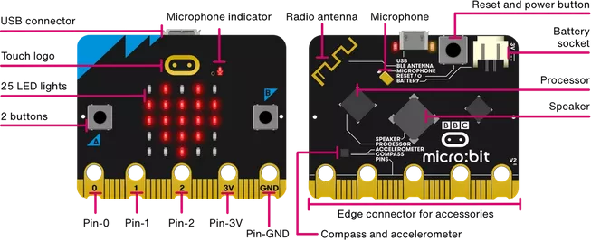

**************************
Micro:bit - Übersicht 
**************************

Der BBC micro:bit ist ein programmierbarer Mikrocomputer bzw. Mikrocontroller - mit dem man alle 
möglichen Projekte erstellen kann, von Robotern bis hin zu Musikinstrumenten - die Möglichkeiten 
sind endlos. Lass uns einen Blick auf die Funktionen werfen, die du in deinen Programmen verwenden kannst:

 * 25 rote LED-Lichter, die Nachrichten und Bilder anzeigen können.
 * Zwei programmierbare Tasten (A und B), mit denen du dem micro:bit sagen kannst, wann er etwas starten und stoppen soll.
 * Ein Thermistor, um die Temperatur zu messen.
 * Ein Lichtsensor, um die Veränderung des Lichts zu messen.
 * Ein Beschleunigungssensor, um Bewegungen zu erkennen.
 * Ein Magnetometer, um dir zu sagen, in welche Richtung du gehst.
 * Eine Funk- und eine Bluetooth-Verbindung, um mit anderen Geräten zu interagieren.
 * Ein Microphon und einen Lautsprecher
 * Eine berührungssensitive Taste als Logo

   
   Source: https://microbit.org/guide/features/

Du kannst den micro:bit mit verschiedenen Sprachen_ programmieren.

.. _Sprachen: https://microbit.org/code/

Zur Auswahl stehen MicroPython, C++ oder JavaScript. Dieses Tutorial konzentriert sich auf das Programmieren von 
micro:bit mit MicroPython, aber wenn du bereits mit Python vertraut bist oder eine zusätzliche Herausforderung suchst, 
schau dir den Abschnitt :ref:`Programmierung des micro:bit mit anderen Sprachen` an.

MicroPython ist eine Version von Python_, die auf Mikrocontrollern wie dem micro:bit laufen kann. Da die 
Funktionalität der beiden nahezu identisch ist (siehe hier_ für den Unterschied im Verhalten), beziehen wir 
uns in diesen Tutorials auf die verwendete Sprache als Python anstatt MicroPython.

Programmieren in Python besteht aus dem Beschreiben einer Reihe von Schritten, die ausgeführt werden sollen.
An welche Regeln du dich dabei (ähnlich wie der Grammatik beim Sprachenlernen) ganz genau halten musst, lernst du Schritt für 
Schritt, wenn du deine ersten Programme schreibst.  

.. _Python: https://www.python.org/
.. _hier: https://docs.micropython.org/en/latest/genrst/index.html
.. figure:: assets/programming.jpg
   :align: center 
   :scale: 30 %

   Source: HOMEWORK

Leitfaden für diese Anleitung
===============================

Die Abschnitte dieses Tutorials sollen dir die Grundlagen der Programmierung und die Funktionen des micro:bit
vermitteln. Das Ziel ist es, dich soweit mit dem Programmieren vertraut zu machen, dass du ein eigenes kleines 
Projekt erstellen kannst. 

Unter anderem versuchen wir gemeinsam ein (immer besseres) *Schere-Stein-Papier-Spiel* zu machen - von ganz 
einfach bis ... (ganz deiner Phantasie überlassen!). Das Erlernen der Programmiersprache Python sollte dabei
irgendwie *nebenbei passieren* 👍.

Du brauchst dich nicht unbedingt akribisch durch die ganze Theorie, die in :ref:`Grundlagen der Programmierung` 
behandelt wird, durcharbeiten, besonders wenn du ein Anfänger bist. Fange an, einfache Programme mit dem 
micro:bit zu schreiben und lerne nach und nach weitere Programmierkonzepte kennen indem du weiterliest. 

Wenn du schon mit der grafischen Programmieroberfläche MakeCode_ vertraut bist, lass dir deine Programme auch einmal als
Python-Code darstellen. Allerdings unterscheidet sich der Code dort etwas von den MicroPython-Befehlen, die wir hier verwenden.
Auch wenn die Syntax (so nennt man die Regeln und den Wortschatz, die für eine Sprache gelten) unterschiedlich ist, kann man
so doch viel über den Aufbau und Ablauf eines Python-Programms lernen.

.. _MakeCode: https://makecode.microbit.org/

Fühle dich frei, die Teile zu überspringen, in denen du dich sicher fühlst und wähle die 
Teile, die dir wichtig sind. Während du mehr über das Programmieren lernst, wirst du natürlich immer bessere und 
effizientere Wege finden, um deine Projekte der Vergangenheit zu erledigen, aber im Moment solltest du dich darauf 
konzentrieren, den Einstieg zu finden.

Die hier behandelten Themen werden in der Regel nur gestreift und viele Dinge werden absichtlich nicht erklärt,
weil eigentlich alles im Internet zu finden ist. Hier sollst du die Grundlagen kennenlernen und vor allem ermutigt
werden, Dinge einfach auszuprobieren! Einige der wichtigen Fähigkeiten die du im Laufe der Schule und deiner späteren
Arbeit brauchen wirst, sind das selbstständige Arbeiten mit Unterlagen und die Fähigkeit, offizielle Dokumente zu lesen.
Daher solltest du ruhig auch andere (und bessere) Unterlagen lesen, als die, die du hier findest.

Wenn deine Fähigkeiten mittel bis fortgeschritten sind, wirst du diese Dokumentation vielleicht nicht sehr interessant 
finden. Wie auch immer, der micro:bit ist ein äußerst flexibles Gerät und du könntest dann vielleicht 
die micro:bit runtime_ erkunden, die dir mehr Flexibilität bei der Verwendung des Geräts bietet.  

.. _runtime: https://lancaster-university.github.io/microbit-docs/

.. note:: Wenn du dir beim Lesen der Tutorials schwer tust und dich nicht auskennst oder du das Gefühl hast, 
   dass du mehr Anleitung brauchst, um mit dem Programmieren beginnen zu können, lass dich nicht entmutigen! 

   **Es gibt nichts Gutes außer man tut es!** Dieser Satz von Erich Kästner beschreibt perfekt das Programmierenlernen.
   Man müsste ihn vielleicht noch ein bisschen erweitern mit: **... und dann tut man es noch einmal, und wenn's 
   immer noch nicht funktioniert eben noch einmal und noch einmal!** 😉

   Es gibt eine Reihe von kostenlosen Online-Kursen, die dir die Grundlagen der Programmierung mit Python näher 
   bringen, wie zum Beispiel python-lernen.de_. Dringend zu empfehlen ist auch dieses YouTube-Tutorial_, das dir die 
   "Sprache" Python und ihre, wie bei allen Programmiersprachen ganz streng einzuhaltende, Grammatik erklärt. 
   
   Beginne auf jeden Fall damit, die ersten paar Lektionen Schritt für Schritt nachzuvollziehen, schau an den oben 
   erwähnten Stellen nach, wie Python funktioniert, wenn etwas nicht so hinhaut wie du dir das gedacht hast, und 
   sieh jeden Fehler als das was er ist - als einen wichtigen Schritt zum Meistercoder! 
   
   Denn mit der Zeit wird alles einen Sinn ergeben.

.. _python-lernen.de: https://www.python-lernen.de/ 
.. _YouTube-Tutorial: https://www.youtube.com/playlist?list=PL_pqkvxZ6ho3u8PJAsUU-rOAQ74D0TqZB