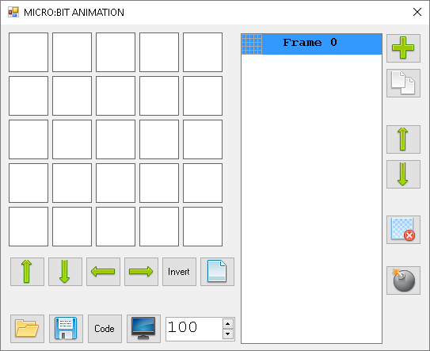

***********
LED Display
***********

Dies ist eine Kurzanleitung für einige Dinge, die du mit dem LED Display machen kannst. Probiere
die Dinge aus - schau, was passiert und was du alles machen kannst. Es gibt 25 LEDs, nummeriert von (0,0)   
in der oberen linken Ecke bis (4,4) in der unteren rechten Ecke und sie können alle auf verschiedene
Helligkeitsstufen eingestellt werden.

Du kannst die LEDs wie einen Bildschirm benutzen, um 
einzelne Zeichen, eine Zeichenkette oder ein kleines Bild anzuzeigen.

.. image:: assets/happy.png
   :align: center
   :scale: 60 %

Grundfunktionen
===============

Einen String oder ein Bild anzeigen
-----------------------------------

Du kannst Zeichen auf dem LED Display mit der Methode ``show`` anzeigen: ::

    from microbit import *

    display.show("Hallo")

Die Zeichen, die du auf dem Display anzeigst, müssen innerhalb eines Paares von Anführungszeichen stehen, entweder " " oder ' '. 
 
Das ``microbit`` Modul hat schon viele Bilder eingebaut, die auf dem Display angezeigt werden können.
Um zum Beispiel eine lächelndes Gesicht anzuzeigen, kannst du das vorhandene ``Image``-Objekt verwenden ::

    from microbit import *

    display.show(Image.HAPPY)

Hier sind einige der anderen Bilder, die du verwenden kannst:

    * ``Image.HEART``, ``Image.HEART_SMALL`` 
    * ``Image.HAPPY``, ``Image.SMILE``, ``Image.SAD``, ``Image.CONFUSED``, ``Image.ANGRY``, ``Image.ASLEEP``, ``Image.SURPRISED``, ``Image.SILLY``, ``Image.FABULOUS``, ``Image.MEH``, ``Image.YES``, ``Image.NO``
    * ``Image.ARROW_N``, ``Image.ARROW_NE``, ``Image.ARROW_E``, ``Image.ARROW_SE``, ``Image.ARROW_S``, ``Image.ARROW_SW``, ``Image.ARROW_W``, ``Image.ARROW_NW``
    * ``Image.MUSIC_CROTCHET``, ``Image.MUSIC_QUAVER``, ``Image.MUSIC_QUAVERS``
    * ``Image.XMAS``, ``Image.PACMAN``, ``Image.TARGET``, ``Image.ROLLERSKATE``, ``Image.STICKFIGURE``, ``Image.GHOST``, ``Image.SWORD``, ``Image.UMBRELLA``
    * ``Image.RABBIT``, ``Image.COW``, ``Image.DUCK``, ``Image.HOUSE``, ``Image.TORTOISE``, ``Image.BUTTERFLY``, ``Image.GIRAFFE``, ``Image.SNAKE``

Eine Laufschrift anzeigen 
-------------------------
Benutze ``scroll``, um einen String am Display als Laufschrift anzuzeigen ::

    from microbit import *

    display.scroll("Hallo!")

Löschen des Displays
---------------------
Wenn du das LED Display löschen möchtest, kannst du dies wie folgt tun: ::

    from microbit import *

    display.clear()

Fortgeschrittene Funktionen
===========================

Ein Pixel setzen
----------------
Du kannst die Helligkeit eines Pixels auf dem LED Display mit der Methode ``set_pixel(spalte,zeile,hellligkeit)``
einstellen: ::

    from microbit import *

    display.set_pixel(0,4,9)

Das setzt die LED in Spalte ``0`` und Zeile ``4`` auf eine Helligkeit von ``9``. Der Helligkeitswert
kann eine ganze Zahl zwischen 0 und 9 sein. 0 schaltet die LED aus und 9 ist die hellste Einstellung.

Du könntest eine :ref:`For Schleife` verwenden, um alle LEDs nacheinander einzustellen: ::

    from microbit import *

    display.clear()
    for x in range(0, 5):
    	for y in range(0, 5):
    	    display.set_pixel(x,y,9)  

Die ``for``- Schleife lässt dich eine Schleife mit Hilfe eines Zählers eine bestimmte Anzahl von Malen
ausführen. Die äußere Schleife::

	for x in range(0,5)

führt die Schleife fünfmal aus und ersetzt ``x`` durch aufeinanderfolgende Werte im Bereich ``0`` bis ``4``
für ``x``. Die Schleife hört auf, bevor sie den letzten Wert im Bereich erreicht.

Die innere Schleife::

	for y in range(0,5):

führt die Schleife fünfmal aus und ersetzt ``y`` jedes Mal durch aufeinanderfolgende Werte aus dem Bereich ``0``
bis ``4``. Die Schleife hört auf, bevor sie den letzten Wert im Bereich erreicht.

Eigene Bilder
-------------
Was ist, wenn du dein eigenes Bild für das Display auf dem micro:bit erstellen möchtest?

Wie bereits erwähnt, kann jedes LED-Pixel auf dem Display auf einen von zehn Werten von 0 (aus) bis 9 (voll ein)
eingestellt werden. Mit dieser Information ist es möglich, ein neues Bild wie dieses zu erstellen ::

        from microbit import *

        boot = Image("05050:"
                        "05050:"
                        "05050:"
                        "99999:"
                        "09990")

        display.show(boot)

Eigentlich brauchst du das nicht über mehrere Zeilen zu schreiben. Wenn du 
den Überblick über jede der Zeilen behältst, kannst du den Code so umschreiben: ::

    boot = Image("05050:05050:05050:99999:09990")

(Wenn es funktioniert, sollte das Gerät ein altmodisches "Blue Peter" Segelschiff anzeigen
wobei die Masten dunkler sind als der Rumpf des Schiffes).

Hast du herausgefunden, wie man ein Bild malt? Hast du bemerkt, dass jede Zeile des
Displays durch eine Zeile aus Zahlen dargestellt wird, die mit ``:`` endet und
zwischen ``"`` Anführungszeichen eingeschlossen ist?

Jede Zahl gibt eine Helligkeit an. Es gibt fünf Zeilen mit fünf Zahlen, so dass es möglich ist,
die individuelle Helligkeit für jedes der fünf Pixel auf jeder der fünf Zeilen auf dem
Display einzustellen und anzuzeigen. 

Welches Bild ist hier zu sehen? ::

    from microbit import *

    meinBild = Image("00900:"
                "09090:"
                "90009:"
                "05550:"
                "05950")
                
    display.show(meinBild)

Animation
---------
Um eine Animation zu machen, benutze einfach eine Liste von Bildern.

Wir können das anhand von bereits eingebauten Listen demonstrieren - ``Image.ALL_CLOCKS``
und ``Image.ALL_ARROWS``: ::

    from microbit import *

    display.show(Image.ALL_CLOCKS, loop=True, delay=100)

Der micro:bit zeigt jedes Bild in der Liste an, eines nach dem anderen. Wenn du ``loop=True``
einstellst, wird das Programm in einer Schleife durch die Liste laufen, ohne Ende. Es ist auch
möglich eine Verzögerung zwischen den Bildern einzustellen, indem man das Attribut ``delay`` auf
den gewünschten Wert in Millisekunden setzt ``delay=100``.

Um deine eigene Animation zu erstellen, musst du also nur eine Liste von Bildern erstellen. 

In diesem Beispiel wird ein Boot im Boden des Displays versinken. Dazu haben wir eine Liste mit 6
Bootsbildern definiert: ::

    from microbit import *

    boat1 = Image("05050:"
                  "05050:"
                  "05050:"
                  "99999:"
                  "09990")

    boat2 = Image("00000:"
                  "05050:"
                  "05050:"
                  "05050:"
                  "99999")

    boat3 = Image("00000:"
                  "00000:"
                  "05050:"
                  "05050:"
                  "05050")

    boat4 = Image("00000:"
                  "00000:"
                  "00000:"
                  "05050:"
                  "05050")

    boat5 = Image("00000:"
                  "00000:"
                  "00000:"
                  "00000:"
                  "05050")

    boat6 = Image("00000:"
                  "00000:"
                  "00000:"
                  "00000:"
                  "00000")

    all_boats = [boat1, boat2, boat3, boat4, boat5, boat6] #Liste aller Boote
    display.show(all_boats, delay=200)    

Übungsaufgaben
===================
* Probiere einige der eingebauten Bilder aus, um zu sehen, wie sie aussehen. 
* Animiere die ``Image.ALL_ARROWS`` Liste. Wie vermeidest du eine ewige Schleife (Hinweis: das Gegenteil von ``True`` ist ``False``). Kannst du die Geschwindigkeit der Animation verändern?
* Erstelle dein eigenes Bild. Versuche als nächstes, es aus- und wieder einzublenden?
* Programmiere einen Würfel, der zufällig eines der 6 Würfelmuster anzeigt
* Mache ein Sprite, benutze eine einzelne LED auf dem Display. Kannst du es springen lassen, wenn du eine Taste drückst?

.. tip::
    Auf der sehr empfehlenswerten Seite MultiWingSpan_ kann man ein kleines Tool herunterladen,
    mit dem man den Code für solche micro:bit Bilder und Animationen ganz einfach erstellen kann!

.. _MultiWingSpan: http://multiwingspan.co.uk/micro.php?page=vbanim

